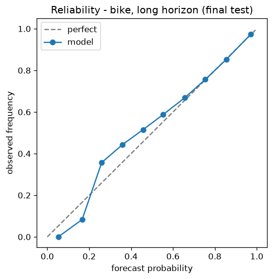

# Dublin Bikes Forecast

Publicly scored probability forecasts for dublinbikes availability at commute
times: **P(at least one bike)** and **P(at least one free dock)** per station at
08:30 and 17:30 (Europe/Dublin), at two horizons (~90 min and overnight).

Every forecast is written to an append-only git ledger **before its target time
exists**, then scored against reality under a gate that was pre-registered
before any data was collected.

**▶ Live scoreboard: [aleks-drozy.github.io/dublin-bikes-forecast](https://aleks-drozy.github.io/dublin-bikes-forecast/)**

## Status

| | |
|---|---|
| Ingestion | **Live** — 10-minute GBFS polls, committed to `data/raw/` |
| Model | **v1, frozen** 2026-07-21 (`models/v1/manifest.json`) |
| Live ledger | **Issuing** — first forecast 2026-07-21 22:02 UTC |
| Scored days | **1 of 28** (first scoring run 2026-07-22 23:45 UTC, on schedule) |
| Verdict | **PENDING** — earliest possible ~2026-08-19 |

One scored day exists and 27 more are needed before anything is claimed —
single-day skill numbers are noise by design, so none are quoted here; the
scoreboard renders the live ledger directly. Day 1 is also honestly
incomplete: the 228 targets issued for the 2026-07-22 morning window are
all recorded `UNSCOREABLE_GAP` — the first-night poll outage left no
observation inside the ±10-minute eligibility window — and they are
published as such rather than quietly dropped.

## What the offline validation found

Model v1 was trained on **671,312 station-hours** across 26 months of the Smart
Dublin historical archive (2024-05 .. 2026-06). Two months, 2024-01 and 2024-02,
were **rejected on quality** and excluded.

On a held-out test split, the model beats both pre-registered baselines at every
event × horizon, with day-clustered bootstrap 95% CIs that exclude zero in all
eight cases:

| Event | Horizon | n | Brier | BSS vs climatology (95% CI) | BSS vs persistence (95% CI) |
|---|---|---|---|---|---|
| bike | long | 20,556 | 0.0748 | +0.087 [0.073, 0.102] | +0.464 [0.444, 0.482] |
| bike | short | 20,901 | 0.0640 | +0.219 [0.192, 0.247] | +0.429 [0.398, 0.455] |
| dock | long | 20,556 | 0.0220 | +0.195 [0.160, 0.237] | +0.486 [0.452, 0.518] |
| dock | short | 20,901 | 0.0194 | +0.290 [0.261, 0.321] | +0.458 [0.426, 0.491] |



Full report and all four reliability curves: [`reports/p2/REPORT.md`](reports/p2/REPORT.md).

**This is not the claim.** Offline skill on archive data is what earned the model
a live deployment — nothing more. The only result that counts is the live one,
scored on forecasts issued before the fact, and that verdict is still PENDING.

## Pre-registration

The verdict gate — Brier skill vs climatology **and** persistence, day-clustered
bootstrap 95% CI excluding zero, 28 live days — is fixed in
[`docs/specs/2026-07-21-forecast-preregistration.md`](docs/specs/2026-07-21-forecast-preregistration.md).

The ordering is checkable in this repository's history:

| Commit | When (UTC) | What |
|---|---|---|
| `d3a996d` | 2026-07-21 14:37 | Gate and baselines committed |
| `36bcab2` | 2026-07-21 15:14 | First data poll |
| `fc5eecc` | 2026-07-21 21:58 | Model v1 frozen |
| `87deebb` | 2026-07-21 22:02 | First live forecast issued |

The gate was written 37 minutes before the first row of data existed, and about
seven hours before any model did.

## Honesty rules

- Forecasts enter the ledger committed **before** target time. Git timestamps are
  the audit trail.
- Missed polls, feed gaps and unscoreable targets are **counted and published**,
  not dropped.
- Baselines freeze before the live ledger starts.
- Losing to persistence is published as **NOT PROVEN**, in the same place and the
  same typeface as a pass.

## Verify it yourself

Everything the scoreboard displays is read from files in this repository:

- `ledger/forecasts/YYYY-MM-DD.csv` — every issued forecast, with `p_model`,
  `p_clim`, `p_pers` and the issue timestamp
- `ledger/outcomes/YYYY-MM-DD.csv` — the scored outcome, or the reason it was not
  scoreable
- `ledger/gate.json` — scored-day count and gate status
- `models/v1/manifest.json` — training window, seed, feature list, code commit

## Development

```
python -m venv .venv
.venv/Scripts/pip install -e ".[dev]"
.venv/Scripts/python -m pytest
```

68 tests, all network-free — fetching is injected everywhere.

Live operation runs from a small always-on VM (`ops/RUNBOOK.md`): hourly
Dublin-hour-gated issuance, nightly scoring at 23:45 UTC, both pushing to this
repository under a shared lock.

## Licence

MIT — see [LICENSE](LICENSE).
